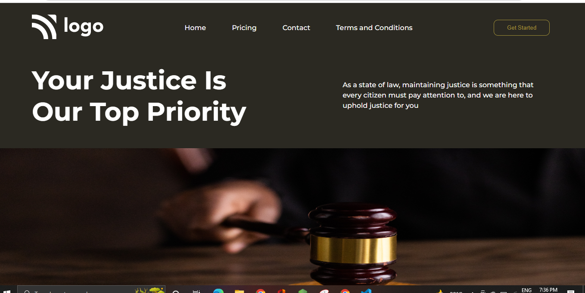

## Name- Anurag Pathak

## Hashnode link- [Markdown guide](https://img.shields.io/badge/project-developer%20landingpage-green)

# Badge

# project name
## Law Homepage

# Time
2 hours 
# What I learn
* Background image
* positions
* Designing button
* box-model

# screenshot of the project.

## Thanks to-

